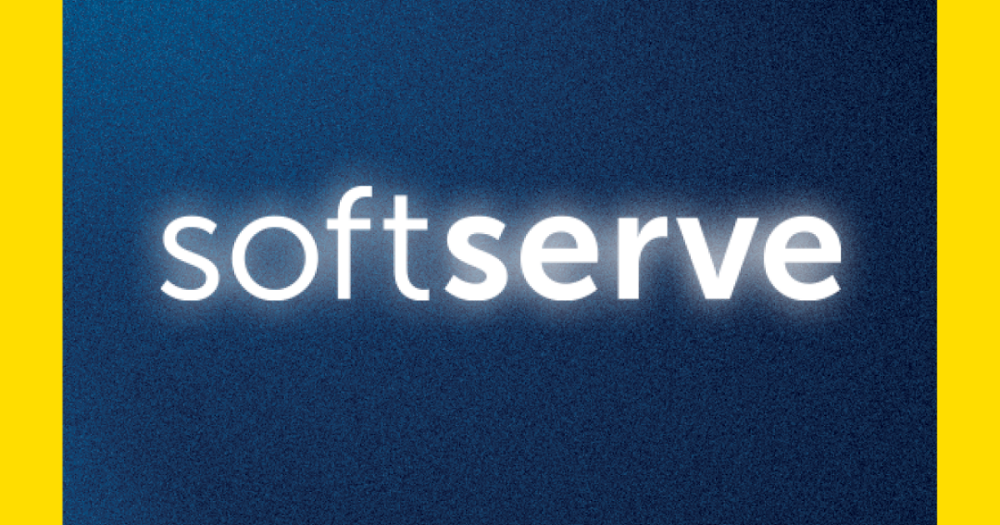

# DEVOPS PROJECT LAB CHILE

    

Step into the IT world under the mentors’ guidance! Become job-ready and boost your skills with the practical experience of working on a project with real challenges

Why should you choose DevOps? It’s where your decisions matter: you’ll deliver tangible business outcomes within your role and create a real business impact. You’ll have a helicopter view over the operations and development, which will provide you with endless opportunities to learn and refine your skills.

Develop your skills, broaden your mind and become a part of our team – we offer the Apprenticeship to the best alumni!

**PROJECT LAB ADVANTAGES**

1. **3 months of practice** to list on your CV  (February 10, 2025 to May 9, 2025)
2. **A real project** with real challenges  
3. **Develop job-ready skills**, both technical and soft skills  
4. **Mentors’ advice** and Tech Leads’ guidance  
5. **Improve your English level** with classes  
6. **Opportunity to enroll in the Apprenticeship program** and become a Junior Developer  

**PROJECT LAB INFORMATION**

| Sphere              | Description |
|---------------------|-------------|
| **Processes**       | - Software development processes: Scrum, Jira, Kanban |
| **Programming & OOP** | - Python, Code Conventions, Python Basics and OOP, VSCode usage    - Introduction to architecture and design patterns: MVC, Flask overview    - Testing types, Unit/Integration testing, Test design techniques    - Unit testing in Python, developing a testing environment, Documentation |
| **Database Management** | - Installing and configuring databases, User management (privileges, permissions, roles)    - Backups, Types, Recovery and disaster recovery, Basic monitoring    - Tables, relationships, keys, constraints understanding    - DDL, DML, DCL understanding    - Access to databases with Python using ORM |
| **Continuous Integration** | - Principles of continuous integration, Automated build concept    - CI using Jenkins    - Integration with Jira for ticket creation    - Implement basic monitoring for application resources |
| **Continuous Delivery** | - Continuous delivery intro, CD with CI Tools and plugins, CD Tools (GoCD) |
| **Branching Strategies** | - Source control, Git basics (GitHub, GitLab)    - Branches and tags management strategy |
| **Virtualization** | - Types of virtualization (hardware emulation, full virtualization, paravirtualization, OS-level virtualization)    - Containers (LXC, Docker) |
| **Automation** | - Shell Scripting    - Python for administration |
| **Monitoring** | - Distributed monitoring    - Logging (integrations, IaC Configs and alarms) |
| **Cloud Computing** | - Understanding services and applications by type    - Cloud service models    - Cloud computing platforms (AWS, Azure, Google Cloud, OpenStack, etc.)    - Orchestration (Terraform, AWS CloudFormation, Azure Resource Manager, etc.) |

> 💡 **Note**: You can find more information about these concepts in the [Glossary](glossary.md).