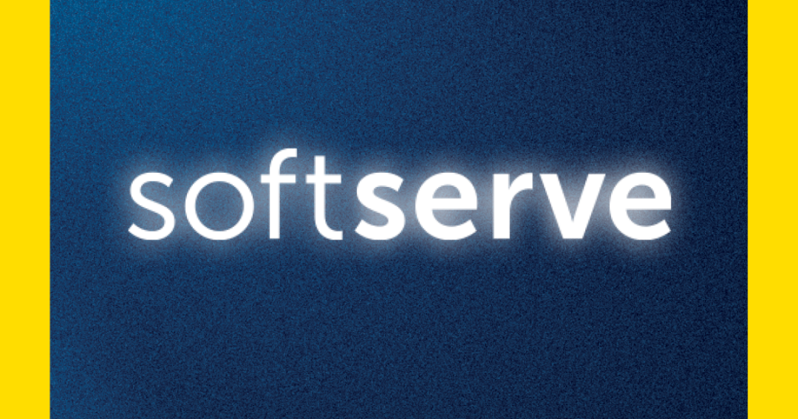

# Week 1 - Introduction to DevOps

    

## Conceptos Básicos

* **Cloud computing**: la nube, que es la infraestructura en la que se ejecutan los programas informáticos
* **Software**: programas informáticos que hacen las cosas que necesitan los humanos
* **DevOps**: la integración de la nube y los programas informáticos
* **Lenguaje Compilado**: un lenguaje que se compila antes de ser ejecutado
*  **Lenguaje Interpretado**: un lenguaje que se compila después de ser ejecutado